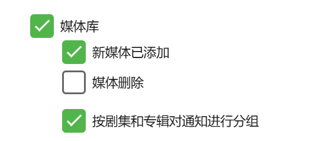

# Emby 自动标签工具

这是一个用于 Emby 的辅助工具，它通过接收 Emby 的 Webhook 通知，根据用户自定义的规则，自动为电影和剧集添加标签。

项目已经停更 功能已经迁移到 https://github.com/pipi20xx/EmbyLens

## 更新日志

<details>
<summary>点击展开/折叠</summary>

- **v1.1.0 (2025-09-01)**
  - **新增功能**: 为管理面板添加了可配置的登录验证功能。
    - 现在可以启用登录验证来保护管理页面，防止未经授权的访问。
    - 在管理页面的“登录设置”区域，可以动态地启用或禁用此功能，并随时修改登录的用户名和密码。
    - 所有登录相关的设置（包括用于JWT签名的密钥）都会自动生成并保存在配置文件中。
- **v1.0.20 (2025-08-30)**
  - **新增功能**: 添加了浏览器页面标签图标 (favicon)。
    - 在 `backend/templates/manage.html` 中引入了 `/static/img/favicon.svg` 作为页面图标。
    - 用户需将 `favicon.svg` 文件放置在 `backend/static/img/` 目录下。
- **v1.0.19 (2025-08-28)**
  - **修复**: 修正了负向匹配中“作用范围”（`item_type`）的逻辑。
    - 现在 `item_type` 的匹配结果将始终保持正向，不再受“负向匹配”选项的反转影响，确保其作为独立的条件进行判断。
- **v1.0.18 (2025-08-27)**
  - **新增功能**: Webhook 通知处理改为队列模式。
    - 实现了异步队列处理机制，所有传入的 Webhook 通知将先进入队列，然后由后台消费者任务按顺序处理，有效避免通知堆积。
    - `backend/api/routers/webhook.py` 中的核心处理逻辑已封装到 `_process_webhook_payload` 函数。
    - `backend/main.py` 在应用启动时初始化队列并启动消费者任务，在关闭时优雅地等待任务完成。
  - **数据更新**: 更新了国家/地区列表。
    - 在 `backend/core/constants.py` 的 `COUNTRY_CODE_MAP` 中增加了“中国澳门”和“沙特阿拉伯”。
- **v1.0.17 (2025-08-27)**
  - **新增功能**: 在管理面板中添加了“标签规则匹配说明”的查看功能。
    - 在“标签规则管理”部分新增“查看规则说明”按钮，点击后会弹出详细的规则说明模态框。
    - 规则说明内容经过格式化和颜色高亮，方便用户理解。
  - **修复/优化**: 标签规则匹配逻辑与说明完全一致。
    - 修正了 `backend/services/rule_service.py` 中负向严格匹配的逻辑，使其与说明中的预期行为一致。
    - 调整了负向匹配的应用范围，现在是针对整个规则的最终匹配结果进行反转。
    - 后端现在支持解析年份范围（例如 "2000-2010"），与前端输入框的说明保持一致。
- **v1.0.16 (2025-08-27)**
  - **新增功能**: 标签规则支持“负向匹配”模式。
    - 在规则编辑界面新增“负向匹配”复选框。
    - 勾选此选项后，规则的条件将反转，即当媒体不符合规则条件时，该规则才会被视为匹配。
  - **优化**: 统一并优化了标签规则的组合判断逻辑。
    - 现在，无论是否勾选“严格匹配所有条件”，规则中所有定义的条件（国家、类型、年份、媒体类型）之间都将是**“与”关系**。
    - “严格匹配所有条件”复选框现在仅控制**单个条件内部**的匹配逻辑：
      - **不勾选“严格匹配所有条件” (模糊匹配)**: 单个条件内部（如国家/地区或类型）只要命中任一元素即视为匹配。
      - **勾选“严格匹配所有条件” (严格匹配)**: 单个条件内部（如国家/地区或类型）必须命中所有元素才视为匹配。
    - “负向匹配”逻辑已与此新的组合判断逻辑正确结合。
- **v1.0.15 (2025-08-26)**
  - **新增功能**: 标签规则支持年份范围输入。
    - 在规则编辑界面，年份输入框现在支持 `YYYY-YYYY` 格式的范围输入（例如 `1999-2020`），系统将自动解析为该范围内的所有年份。
    - 同时支持逗号或空格分隔的多个具体年份输入（例如 `1999, 2001, 2005`）。
- **v1.0.14 (2025-08-26)**
  - **新增功能**: Webhook 自动化处理添加延迟设置。
    - 在 Webhook 管理面板新增“自动化处理延迟”输入框，允许用户设置 Webhook 消息处理前的延迟时间（秒）。
    - 默认延迟为 1 秒，可设置为 0 表示不延迟，支持小数输入。
  - **修复**: 修复了前端配置页面 TMDB 访问频率限制周期重复显示的问题。
    - 后端 `config_service.py` 不再对 `rate_limit_period` 进行中文化处理，前端 `main.js` 通过 `keyNames` 映射进行显示。
- **v1.0.13 (2025-08-26)**
  - **新增功能**: 标签规则支持年份范围输入。
    - 在规则编辑界面，年份输入框现在支持 `YYYY-YYYY` 格式的范围输入（例如 `1999-2020`），系统将自动解析为该范围内的所有年份。
    - 同时支持逗号或空格分隔的多个具体年份输入（例如 `1999, 2001, 2005`）。
- **v1.0.12 (2025-08-25)**
  - **修复**: 修复了 `find_emby_items_by_tmdb_id` 函数无法获取同一 TMDB ID 对应的所有 Emby 媒体项目（多版本）的问题。
    - 将 `find_emby_items_by_tmdb_id` 函数的 Emby API 端点从 `/emby/Users/{UserId}/Items` 修改为 `/emby/Items`，并使用 `TmdbId` 参数进行查询，与桌面版 `emby.py` 的搜索逻辑保持一致，确保能够正确获取所有多版本媒体项目。
- **v1.0.11 (2025-08-25)**
  - **新增功能**: “一键为所有媒体打标签”功能支持自定义标签。
    - 在 Web 管理面板的“一键为所有媒体打标签”区域新增复选框和输入框，允许用户选择使用自定义标签。
    - 自定义标签支持逗号分隔输入多个。
    - 选中自定义标签后，系统将使用用户提供的标签，而非规则生成的标签，对媒体进行打标签操作。
- **v1.0.10 (2025-08-25)**
  - **修复**: 修复了 `tag_all_media_items()` 函数中 `library_type` 参数无效的问题，并支持对“最爱”媒体库进行打标签操作。
    - 删除了 `backend/services/emby_service.py` 中重复的 `tag_all_media_items` 函数定义，确保 `library_type` 参数能够正确传递和使用，从而支持对全库和最爱媒体进行打标签。
- **v1.0.9 (2025-08-25)**
  - **新增功能**: 添加了“清除 Emby 媒体库中的指定标签”功能。
    - 在 Web 管理面板中新增了“清除 Emby 媒体库中的指定标签”区域，允许用户输入一个或多个标签，并从所有电影和剧集中移除这些标签。
    - 此操作不可撤销，请谨慎使用。
- **v1.0.8 (2025-08-25)**
  - **新增功能**: 标签规则支持筛选年份。
  - **优化**: 严格规则的判断逻辑修改为完全相等匹配。
- **v1.0.7 (2025-08-25)**
  - **新增功能**: 标签规则支持“严格匹配所有条件”选项。
    - 在规则编辑界面新增“严格匹配所有条件”复选框。
    - 勾选此选项后，规则中的国家/地区和类型条件将变为严格匹配模式，即传入的媒体信息必须包含规则中定义的所有国家/地区和类型 ID 才能匹配成功。
    - 未勾选时，保持原有模糊匹配逻辑（只要命中一个就算匹配）。
- **v1.0.6 (2025-08-25)**
  - **前端**: 对管理面板进行了全面的 UI/UX 美化。
    - **样式现代化**: 更新了整体 CSS 样式，包括颜色、字体、边距和阴影，使界面更具现代感。
    - **通知系统**: 引入 `Toastify-js`，将所有操作结果（如复制成功、保存配置、任务状态等）统一为右上角弹出的 Toast 通知，取代了页面内的文字提示。
    - **美化弹窗**: 引入 `SweetAlert2`，将所有原生 `confirm` 确认框替换为更美观、更友好的对话框。
    - **自适应布局**: 优化了“标签规则管理”弹窗，使其宽度能根据浏览器视口自适应，并使用 CSS Grid 布局使内部的复选框列数能够动态调整，极大地改善了在不同分辨率屏幕上的显示效果和空间利用率。
- **v1.0.5 (2025-08-24)**
  - **优化**: 统一并优化了国家/地区的判断逻辑。
    - **严格限定判断依据**：现在无论是电影还是电视剧，都严格使用 TMDB 数据根目录下的 `origin_country` 字段作为首要判断依据，`original_language` 作为备用。
    - **排除干扰字段**：完全移除了 `production_countries` 和 `production_companies` 作为判断国家/地区的逻辑，解决了因此导致的国家识别不准确问题。
  - **改进**: 优化了测试预览界面的显示。
    - 在预览结果中，地区将优先显示中文名称，使结果更直观、更易于理解。
- **v1.0.4 (2025-08-24)**
  - **新增功能**: 标签规则支持设置作用于电影、剧集或全部。
    - 在规则编辑界面新增“作用于”选项，允许用户指定规则仅应用于电影、剧集或所有媒体类型。
    - 后端逻辑已更新，根据此设置过滤规则。
- **v1.0.3 (2025-08-24)**
  - **新增功能**: TMDB 请求限流功能。
    - 增加了对 TMDB API 请求的限流，默认每秒1次。
    - 限流周期可在配置页面设置，支持小数（如0.3秒、0.5秒），设置为0表示不限制。
  - **依赖更新**: 添加了 `ratelimit` 和 `backoff` 库。
- **v1.0.2 (2025-08-24)**
  - **新增功能**: 添加了“一键为所有媒体打标签”功能。
    - 在 Web 管理面板中新增了“一键为所有媒体打标签”区域，允许用户选择写入模式（合并/覆盖）并触发对所有电影和剧集进行打标签操作。
    - 任务在后台异步执行，前端页面通过轮询API实时显示任务进度（已处理、已更新、失败数量）。
  - **改进**: 优化了后台任务的日志记录，将 `print` 语句替换为 `logging` 模块。
  - **修复**: 修复了 `AttributeError: module 'services.config_service' has no attribute 'get_current_time'` 错误。
- **v1.0.1 (2025-08-24)**
  - **新增功能**: 添加了“清除所有 Emby 媒体库标签”功能。
    - 在 Web 管理面板中新增了“清除所有 Emby 媒体库标签”按钮，允许用户一键清除所有电影和剧集的标签。
    - 此操作不可撤销，请谨慎使用。
- **v1.0.0 (2025-08-24)**
  - 项目初始化。

</details>

## 核心功能

- **Webhook 驱动的自动化**: 通过 Emby Webhook 实时响应媒体库更新。
- **基于规则的标签生成**: 可视化创建和管理标签规则。
- **灵活的标签写入**: 支持合并和覆盖两种模式，并提供预览。
- **全面的 Web 管理面板**: 轻松完成所有配置、规则设定和功能测试。
- **TMDB 集成**: 利用 The Movie Database (TMDB) 的数据来丰富媒体信息。
- **Docker 支持**：易于通过 Docker 和 Docker Compose 进行部署。
- **自定义标签**：通过TMDB返还的信息提取地区和类型来进行自定义标签操作。

## 快速开始

## Docker Compose 示例

```yaml
version: '3.8'

services:
  backend:
    image: pipi20xx/emby-auto-tags:latest
    container_name: emby-auto-tags
    ports:
      - "6005:8000"
    volumes:
      - ./config:/app/config
    restart: always
    network_mode: bridge
```

webhook通知选择类型为JSON


## 🙏 致谢

本项目的设计和功能受到了以下优秀项目的启发，特此感谢：

- **[kuroyukihime0/emby_scripts](https://github.com/kuroyukihime0/emby_scripts)**
---
